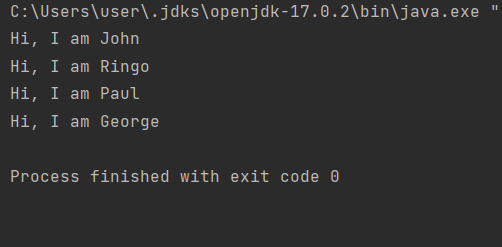
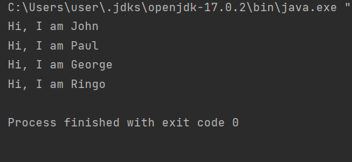
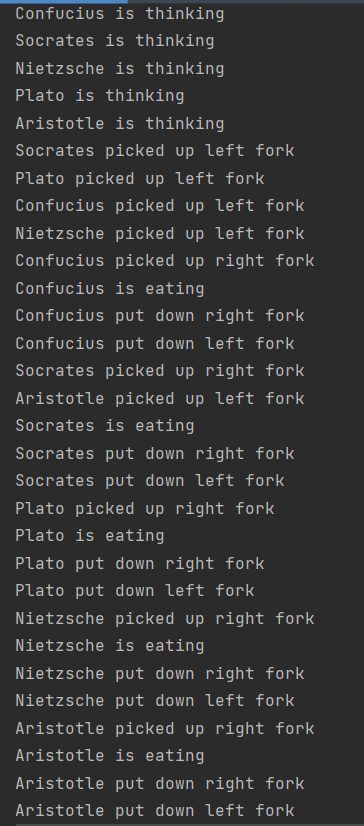

### Task 2

Для того, чтобы запустить программу, необходимо перейти в класс Main, запустить метод main().

[Main](Main.java)

Результат работы программы

### Задача об обедающих философах

Для того, чтобы запустить программу, необходимо перейти в класс Philosophers, запустить метод main().

[Philosophers](Philosophers.java)

