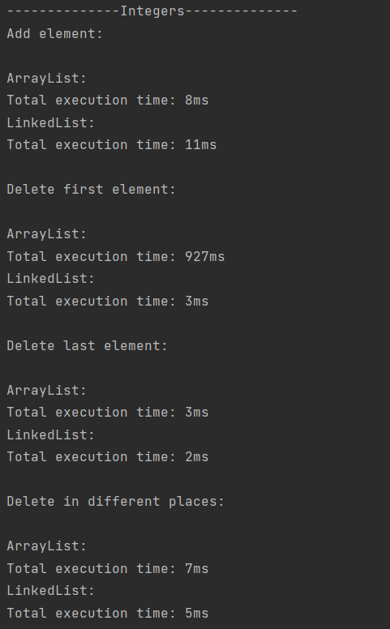
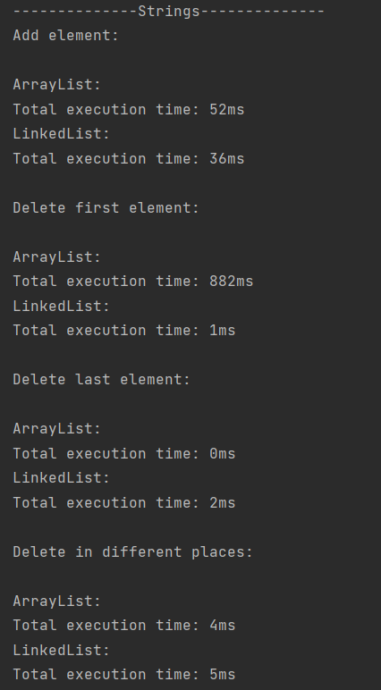

### Task 9

Для того, чтобы запустить программу, необходимо перейти в класс Main, запустить метод main().

[Main](Main.java)

### Информация о компьютере

| Элемент      | Значение                                                                                |
|--------------|-----------------------------------------------------------------------------------------|
| Изготовитель | Acer                                                                                    |
| Модель       | Nitro AN515-54                                                                          |
| Процесор     | Intel(R) Core(TM) i7-9750H CPU @ 2.60GHz, 2592 МГц, ядер: 6, логических процессоров: 12 |
| RAM          | 8,00 ГБ                                                                                 |

###Benchmark
Целые числа

Строки

