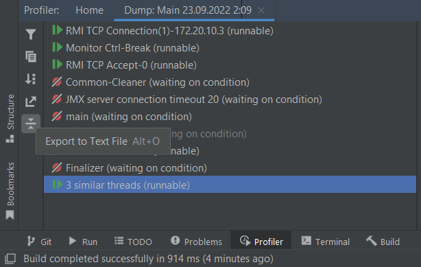

### Homework 2

Для данного задания была написана программа, падающая с OutOfMemory.
Для запуска необходимо перейти в класс [Main](src/Main.java), запустить метод main(). 

Написанная программа падает во время пятой по счёту итерации цикла:

Пользуясь этим фактом, а также методом Thread.sleep(), перед падением программы можно снять Thread Dump.
Для этого, в IntelliJ IDEA нужно перейти во вкладку profiler, найти интересующий процесс и нажать Get Thread Dump.

Далее в том же окне можно экспортировать полученный Thread Dump в текстовый файл.

Данный Thread Dump можно найти в файле [thread_report.txt](resources/threads_report.txt).

Аналогично снимаем heap dump, но нажимаем Capture Memory Snapshot.

В корневой папке появился .hprof файл, который можно проанализировать при помощи Eclipse Memory Analyzer. Ниже приложен результат работы анализатора.

